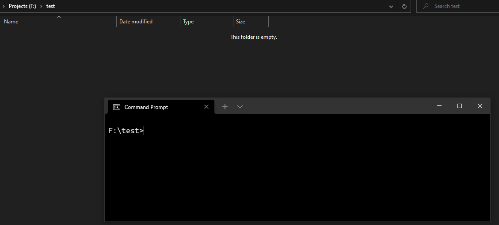

[1-img]: https://img.shields.io/github/workflow/status/ISKalsi/leet-scrape/CLI?label=CLI%20build

[1]: https://github.com/ISKalsi/leet-scrape/actions/workflows/cli.yml

[2-img]: https://img.shields.io/github/workflow/status/ISKalsi/leet-scrape/Test?label=tests

[2]: https://github.com/ISKalsi/leet-scrape/actions/workflows/test.yml

[3-img]: https://goreportcard.com/badge/github.com/ISKalsi/leet-scrape

[3]: https://goreportcard.com/report/github.com/ISKalsi/leet-scrape

[4-img]: https://img.shields.io/github/go-mod/go-version/ISKalsi/leet-scrape

# Leetscrape

[![CLI build][1-img]][1] [![Tests][2-img]][2] [![Go reportcard][3-img]][3] ![Go version][4-img]

An unofficial utility that can download Leetcode problems using its GraphQL API.



## 📜Examples in GIF 👆

- ### Question

```bash
leetscrape --daily-challenge question
```

```bash
leetscrape --name "two sum" question
```

- ### Solution

```bash
leetscrape --number 58 solution --lang C++
```

```bash
leetscrape --url "leetcode.com/problems/3sum" solution --lang java
```

More details in the [Usage](#-usage) section.

## ⚙ Installation

- ### Using Go
  1. Make sure you have [Go](https://golang.org/doc/install) (`1.16` or greater) installed with your `$GOROOT`
     environment variable correctly setup. (If you installed Go in the default location, then you don't need to worry
     about setting up `$GOROOT`)

  2. Run the following command in your shell

   ```bash
   go install github.com/ISKalsi/leet-scrape/v2/cmd/leetscrape@latest
   ```

## 🧰 Usage

For every problem you can either download its default code snippet or the question statement. This is done by using the
following sub-commands -

- `question` or `ques` - This downloads the full question (including images) in an HTML file
- `solution` or `sol` - This downloads the default code snippet in the Leetcode's editor when you start solving a fresh
  problem. You have to specify the language using the `--lang` (or `-l`) flag (choose any one of the available options
  given in Leetcode's editor)

This tool provides four ways to find a problem -

| Searching Method | Flag                        | Example                                                      |
| ---------------- | :-------------------------- | ------------------------------------------------------------ |
| Name             | `--name` or `-n`            | `leetscrape -n "two sum" sol python`                         |
| Number           | `--number` or `-N`          | `leetscrape -N 1 sol -l C++`                                 |
| URL              | `--url` or `-u`             | `leetscrape -u "https://leetcode.com/problems/two-sum/" ques`|
| Daily Challenge  | `--daily-challenge` or `-d` | `leetscrape -d ques`                                         |

**Note:** providing one of the four methods is necessary.

### Additional Flags

- `--output-dir` or `-o`
  *Command:* `leetscrape`
  *Example:* `leetscrape -o random/path -n "two sum" ques`
  By default the file is downloaded to the working directory. To provide a custom path, specify the flag and give a **
  relative** path.
- `--boilerplate` or `-b`
  *Command:* `solution`
  *Example:* `leetscrape -n "two sum" sol -l C++ -b "#include<string>\nusing namespace std;\n"`
  This will prepend the given string to the code snippet before writing to file.

## 💭 QnA

- ### Why did I make this tool?

  Two Reasons -

  **First:** I solve my Leetcode problems in a local IDE instead of their embedded editor because it's so shitty for
  non-premium users (no formatting/autocomplete/debugging). So this is what used to happen - Go to the problem, copy the
  code in editor, make new file, paste, add #include headers and other stuff. I had to repeat all those things for every
  new problem. Now I can type a simple command get it all done in one go.
  **Second:** Well, just for fun :)

- ### How did I find Leetcode's API?

  **TL;DR** - *Luck + Hit and trial.*

  I originally planned to make this tool using web-scrapping (via [Colly](https://github.com/gocolly/colly)). I
  struggled quite a lot in between the process when I needed to scrape the page after entering a search query in the
  Problemset page of Leetcode. The problem was that Colly doesn't support scrapping in an AJAX loaded site (meaning -
  the page first loads all the question from 1-50, then executes the search query and displays results. Colly scrapes
  and stops before the query can even happen). To solve this I would have to use a Selenium like package which would
  involve chromium driven browser. Didn't wanna do that.

  While I was searching for some solution in the Inspect-Element window, I found a few graphql entries in the network
  tab. Had no clue what GraphQL was at that time (it is really cool thing, must check it out). Randomly opened a few of
  them and there I found what I really needed but wasn't looking for. Then I spent a few hours getting to know how
  GraphQL works and reverse-engineered the queries from the network tab, and it worked!

- ### While using the `--name` flag, do I need to give the name exactly how it is on Leetcode?

  No, as long as you enter the correct spellings, it will be alright.
  Check [this](https://github.com/ISKalsi/leet-scrape/blob/0abe3ce3f1cee2f1c90b5a7fa5d30f13a7b34f12/data/repo/problem_test.go#L23)
  out for a few examples of a valid names.

- ### While using the `--url` flag, do I need to give the full url?

  Again, no. Just make sure it is in double quotes to avoid any unexpected errors.
  Check [this](https://github.com/ISKalsi/leet-scrape/blob/0abe3ce3f1cee2f1c90b5a7fa5d30f13a7b34f12/data/repo/problem_test.go#L107)
  out for a few examples of a valid urls.

  

